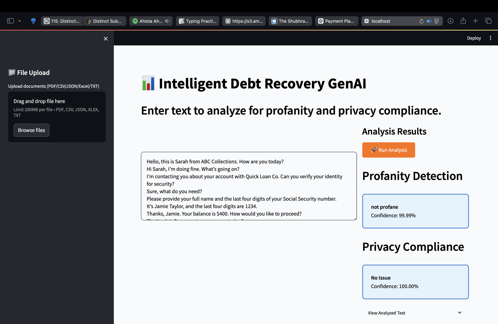

# intelligent-debt-recovery-genai
Intelligent Debt Recovery using GenAI to optimize payment maximization for lenders and debt collectors.

## Setup and Installation

### Prerequisites
1. Clone this repository to your local machine.
2. Install the required dependencies:
   ```bash
   pip install -r requirements.txt
   ```

### File and Directory Configuration
1. Update the **directory paths** according to your operating system for the following files:
   - `src/pattern_matching/profanity_detection/regex.ipynb`
   - `src/pattern_matching/privacy_compliance_detection/regex.py`
   - `call_quality/visualization.ipynb`

2. Update the **file paths** for custom annotated data in the following files:
   - `src/ml_models/privacy_compliance_detection/classification_model.ipynb`
   - `src/ml_models/profanity_detection/classification_model.ipynb`

---

## Resources
- **Project GIF**:
  

- **Project Description**:
  [Download the detailed project overview here](./project/project_description.pdf)

---

by Mohammad Adnaan<br />
[Linkedin](https://www.linkedin.com/in/mohammad-adnaan-51272024a/) | [GitHub](https://github.com/mohd-adnaan)
</br>
